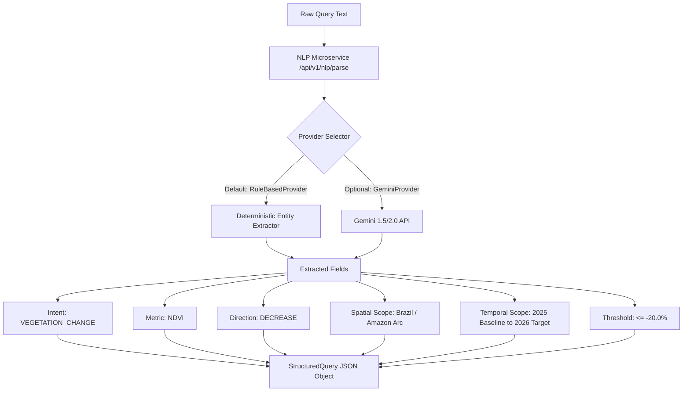

# SatQuery AI — AI, Vision & Remote-Sensing Pipeline

This document provides a comprehensive technical breakdown of the natural language understanding, agentic tooling, and Earth Observation vision intelligence layers in SatQuery AI.

---

## 1. Implementation Status Overview

To ensure strict factual accuracy and transparency, the AI pipeline components are categorized as follows:

| Component | Layer | Status | Capabilities |
|-----------|-------|--------|--------------|
| **Rule-Based Query Intelligence** | NLP Microservice (`services/nlp-service`) | **VERIFIED IMPLEMENTED** | High-speed regex and deterministic entity extraction for environmental intents, metrics, bounding regions, and thresholds. |
| **Spectral Index Math Engine** | EO Analysis Microservice (`services/eo-analysis-service`) | **VERIFIED IMPLEMENTED** | Mathematical BOA band operations for NDVI, NDWI, NDBI, NBR, and EVI with severity classification. |
| **Agentic Tool Registry** | Frontend (`src/services/tools/toolRegistry.ts`) | **VERIFIED IMPLEMENTED** | 6 specialized remote-sensing tools covering optical, radar, hydrological, and forestry domains. |
| **Client-Side Query Orchestrator** | Frontend (`src/services/satQueryOrchestrator.ts`) | **VERIFIED IMPLEMENTED** | Coordinates tool selection, telemetry calculation, and fallback execution. |
| **Multi-Modal Raster Inspector** | Frontend (`src/services/imageInspector.ts`) | **VERIFIED IMPLEMENTED** | Extracts raster dimensions, CRS, bit depth, channel counts, and pixel distributions. |
| **Gemini LLM Provider** | NLP Microservice (`services/nlp-service`) | **IMPLEMENTED HOOK / OPTIONAL** | Dynamic provider selection via `LLM_PROVIDER=gemini` and `GEMINI_API_KEY`. |
| **Colab ML Inference Server** | Integration (`src/services/providers/colabMLAnalysisProvider.ts`) | **IMPLEMENTED ADAPTER / OPTIONAL** | HTTP bridge to remote GPU PyTorch inference instances. |
| **Live STAC Imagery Harvesting** | Data Service (`services/data-service`) | **PLANNED / ROADMAP** | Direct connection to Sentinel Hub / Planetary Computer APIs. |

---

## 2. Natural Language Query Interpretation Flow

When a user submits a query (e.g. *"Show severe deforestation and vegetation loss in Mato Grosso exceeding 20%"*):

### Supported Intent Mapping Matrix

| User Intent Keywords | Resolved Intent Enum | Default Metric | Target Spectral Index Formula |
|----------------------|----------------------|----------------|-------------------------------|
| `forest`, `canopy`, `deforestation`, `vegetation`, `biomass` | `VEGETATION_CHANGE` | `NDVI` | $\frac{\text{NIR} - \text{Red}}{\text{NIR} + \text{Red}}$ |
| `water`, `lake`, `reservoir`, `desiccation`, `salinized` | `WATER_BODY_DYNAMICS` | `NDWI` | $\frac{\text{Green} - \text{NIR}}{\text{Green} + \text{NIR}}$ |
| `urban`, `built-up`, `impervious`, `infrastructure`, `expansion` | `URBAN_EXPANSION` | `NDBI` | $\frac{\text{SWIR} - \text{NIR}}{\text{SWIR} + \text{NIR}}$ |
| `fire`, `burn`, `wildfire`, `burn scar` | `WILDFIRE_BURN_SEVERITY` | `NBR` | $\frac{\text{NIR} - \text{SWIR}}{\text{NIR} + \text{SWIR}}$ |
| `drought`, `stress`, `soil moisture` | `DROUGHT_IMPACT` | `NDVI` / `NDWI` | Multi-index composite |

---

## 3. Remote Sensing Spectral Calculator

The `SpectralCalculator` in `services/eo-analysis-service` computes exact scientific indices from Sentinel-2 and Landsat surface reflectance values:

### 1. Normalized Difference Vegetation Index (NDVI)
$$\text{NDVI} = \frac{\rho_{\text{B08 (NIR)}} - \rho_{\text{B04 (Red)}}}{\rho_{\text{B08 (NIR)}} + \rho_{\text{B04 (Red)}}}$$

### 2. Normalized Difference Water Index (NDWI)
$$\text{NDWI} = \frac{\rho_{\text{B03 (Green)}} - \rho_{\text{B08 (NIR)}}}{\rho_{\text{B03 (Green)}} + \rho_{\text{B08 (NIR)}}}$$

### 3. Normalized Difference Built-Up Index (NDBI)
$$\text{NDBI} = \frac{\rho_{\text{B11 (SWIR1)}} - \rho_{\text{B08 (NIR)}}}{\rho_{\text{B11 (SWIR1)}} + \rho_{\text{B08 (NIR)}}}$$

### 4. Normalized Burn Ratio (NBR)
$$\text{NBR} = \frac{\rho_{\text{B08 (NIR)}} - \rho_{\text{B11 (SWIR1)}}}{\rho_{\text{B08 (NIR)}} + \rho_{\text{B11 (SWIR1)}}}$$

### Delta & Severity Computation
The percentage change $\Delta \%$ is evaluated as:
$$\Delta \% = \left( \frac{\text{Index}_{\text{after}} - \text{Index}_{\text{before}}}{|\text{Index}_{\text{before}}|} \right) \times 100$$

- **Critical**: $|\Delta \%| > 30\%$
- **Significant**: $15\% < |\Delta \%| \le 30\%$
- **Moderate**: $|\Delta \%| \le 15\%$

---

## 4. Agentic Specialist Tools

SatQuery AI exposes a formal suite of 6 domain specialist tools registered in `ToolRegistry`:

1. **`spectral_index_calculator`**: Computes multi-band reflectance ratios and validates spectral distributions.
2. **`canopy_disturbance_detector`**: Detects canopy loss, selective logging patterns, and habitat fragmentation.
3. **`water_extent_tracker`**: Quantifies littoral retreat, lake surface area depletion, and reservoir storage dynamics.
4. **`sar_coherence_analyzer`**: Analyzes SAR Sentinel-1 C-band backscatter for cloud-penetrating change detection.
5. **`fire_scar_mapper`**: Generates dNBR (Delta NBR) maps and burn severity classification polygons.
6. **`urban_growth_profiler`**: Detects newly developed impervious surfaces and rural-to-urban transformations.

---

## 5. Confidence Scoring & Error Handling

- **Cloud Cover Discounting**: Scenes with $> 5\%$ cloud cover automatically receive reduced confidence weighting ($0.84$ vs $0.91$).
- **Multi-Sensor Cross-Validation**: Algorithms verify whether Sentinel-2 (10m) and Landsat-9 (30m) concord on directional anomalies.
- **Graceful Fallbacks**: If downstream microservices or GPU endpoints are unavailable, the query pipeline falls back to client-side in-memory analytics without throwing unhandled exceptions.
