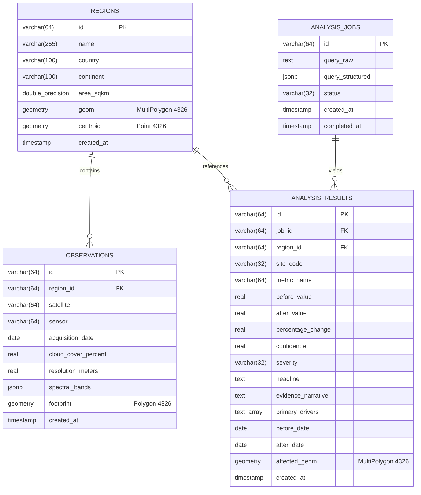

# SatQuery AI — Database & Spatial Storage Specification

SatQuery AI leverages **PostgreSQL 16 with PostGIS 3.4** for high-performance spatial indexing, bounding box containment queries, and Earth Observation scene cataloging.

---

## 1. Database Architecture & Technology Stack

| Property | Value | Notes |
|----------|-------|-------|
| **Database Engine** | PostgreSQL | Version 16.x |
| **Spatial Extension** | PostGIS | Version 3.4+ (`CREATE EXTENSION IF NOT EXISTS postgis;`) |
| **Spatial Reference System (SRID)** | EPSG:4326 (WGS 84) | Standard lon/lat coordinate system for global geospatial data |
| **Primary Container** | `postgis/postgis:16-3.4` | Docker official PostGIS image |
| **Migration Path** | `database/migrations/` | Automatically run on container first-boot via `/docker-entrypoint-initdb.d` |

---

## 2. Entity Relationship Diagram (ERD)



---

## 3. Schema Definitions & Table Specifications

### 3.1 `regions`
Stores critical geographical bounding regions and polygon boundaries.

| Column | Type | Constraints | Description |
|--------|------|-------------|-------------|
| `id` | `VARCHAR(64)` | `PRIMARY KEY` | Unique region ID (e.g. `reg_amazon_arc`) |
| `name` | `VARCHAR(255)` | `NOT NULL` | Human-readable region label |
| `country` | `VARCHAR(100)` | `NOT NULL` | Country of location |
| `continent` | `VARCHAR(100)` | `NULL` | Continent identifier |
| `area_sqkm` | `DOUBLE PRECISION` | `NOT NULL` | Total surface area in square kilometers |
| `geom` | `GEOMETRY(MultiPolygon, 4326)` | `NULL` | Exact polygon boundary geometry |
| `centroid` | `GEOMETRY(Point, 4326)` | `NULL` | Geographic center coordinate for camera navigation |
| `created_at` | `TIMESTAMP WITH TIME ZONE` | `DEFAULT NOW()` | Record timestamp |

**Indexes**:
- `idx_regions_geom`: Spatial `GIST (geom)`
- `idx_regions_centroid`: Spatial `GIST (centroid)`

---

### 3.2 `observations`
Catalogs individual satellite observation acquisitions.

| Column | Type | Constraints | Description |
|--------|------|-------------|-------------|
| `id` | `VARCHAR(64)` | `PRIMARY KEY` | Observation ID (e.g. `obs_amazon_001`) |
| `region_id` | `VARCHAR(64)` | `REFERENCES regions(id)` | Target geographical region |
| `satellite` | `VARCHAR(64)` | `NOT NULL` | Satellite platform (e.g. `Sentinel-2 MSI L2A`) |
| `sensor` | `VARCHAR(64)` | `NOT NULL` | Optical/Radar sensor instrument |
| `acquisition_date` | `DATE` | `NOT NULL` | Date of acquisition |
| `cloud_cover_percent` | `REAL` | `NOT NULL` | Scene cloud cover (0.0 to 100.0) |
| `resolution_meters` | `REAL` | `NOT NULL` | Spatial pixel resolution |
| `spectral_bands` | `JSONB` | `NOT NULL` | Multi-spectral BOA reflectance values |
| `footprint` | `GEOMETRY(Polygon, 4326)` | `NULL` | Scene boundary footprint polygon |
| `created_at` | `TIMESTAMP WITH TIME ZONE` | `DEFAULT NOW()` | Record timestamp |

**Indexes**:
- `idx_observations_region_date`: Composite `BTREE (region_id, acquisition_date)`
- `idx_observations_footprint`: Spatial `GIST (footprint)`

---

### 3.3 `analysis_jobs`
Audit log of all processed natural language queries and job execution states.

| Column | Type | Constraints | Description |
|--------|------|-------------|-------------|
| `id` | `VARCHAR(64)` | `PRIMARY KEY` | Job identifier (e.g. `Q_A89F3B21`) |
| `query_raw` | `TEXT` | `NOT NULL` | Original user query string |
| `query_structured` | `JSONB` | `NOT NULL` | Parsed NLU schema |
| `status` | `VARCHAR(32)` | `DEFAULT 'PENDING'` | `PENDING`, `PROCESSING`, `COMPLETED`, `FAILED` |
| `created_at` | `TIMESTAMP WITH TIME ZONE` | `DEFAULT NOW()` | Submission timestamp |
| `completed_at` | `TIMESTAMP WITH TIME ZONE` | `NULL` | Resolution timestamp |

---

### 3.4 `analysis_results`
Stores analyzed physical metrics, spectral deltas, severity scores, and polygon footprints.

| Column | Type | Constraints | Description |
|--------|------|-------------|-------------|
| `id` | `VARCHAR(64)` | `PRIMARY KEY` | Result ID |
| `job_id` | `VARCHAR(64)` | `REFERENCES analysis_jobs(id)` | Parent job FK |
| `region_id` | `VARCHAR(64)` | `REFERENCES regions(id)` | Target region FK |
| `site_code` | `VARCHAR(32)` | `NOT NULL` | Mission site code (e.g. `SITE_ALPHA`) |
| `metric_name` | `VARCHAR(64)` | `NOT NULL` | Physical metric (e.g. `NDVI Difference`) |
| `before_value` | `REAL` | `NOT NULL` | Baseline numerical value |
| `after_value` | `REAL` | `NOT NULL` | Resurvey numerical value |
| `percentage_change` | `REAL` | `NOT NULL` | Computed percentage delta |
| `confidence` | `REAL` | `NOT NULL` | Statistical confidence (0.0 to 1.0) |
| `severity` | `VARCHAR(32)` | `NOT NULL` | `CRITICAL`, `SIGNIFICANT`, `MODERATE`, `NOMINAL` |
| `headline` | `TEXT` | `NOT NULL` | Key summary headline |
| `evidence_narrative` | `TEXT` | `NOT NULL` | Domain-specific scientific explanation |
| `primary_drivers` | `TEXT[]` | `NOT NULL` | Environmental and anthropogenic drivers |
| `before_date` | `DATE` | `NOT NULL` | Baseline date |
| `after_date` | `DATE` | `NOT NULL` | Target comparison date |
| `affected_geom` | `GEOMETRY(MultiPolygon, 4326)` | `NULL` | Footprint geometry of change area |

**Indexes**:
- `idx_analysis_results_job`: `BTREE (job_id)`
- `idx_analysis_results_affected_geom`: Spatial `GIST (affected_geom)`

---

## 4. Migration & Seeding Procedures

### Automated Initialization (Docker Compose)
When running `docker compose up`, migrations are automatically applied by mounting the `database/migrations` directory into `/docker-entrypoint-initdb.d`:
1. `001_initial_schema.sql` (Creates extension, tables, indexes)
2. `002_seed_regions.sql` (Seeds 6 critical global Earth Observation regions)

### Manual Production Migration (psql)
```bash
psql -h <host> -U <user> -d <dbname> -f database/migrations/001_initial_schema.sql
psql -h <host> -U <user> -d <dbname> -f database/migrations/002_seed_regions.sql
```
