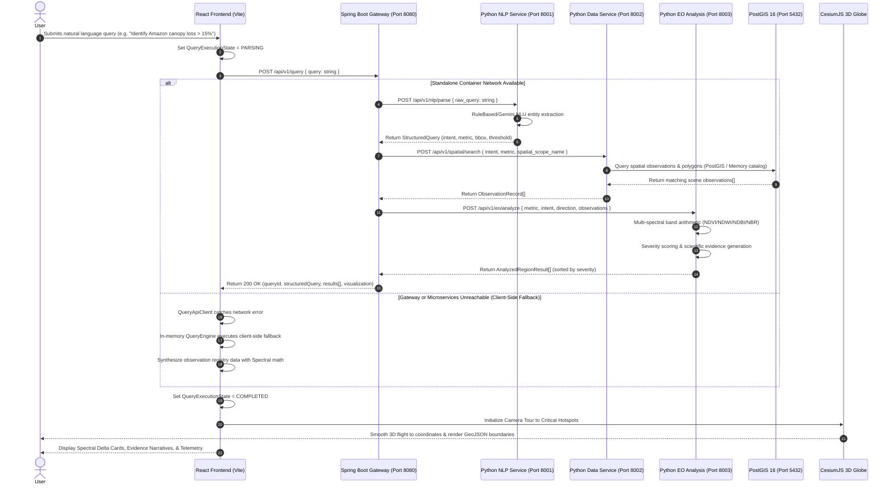
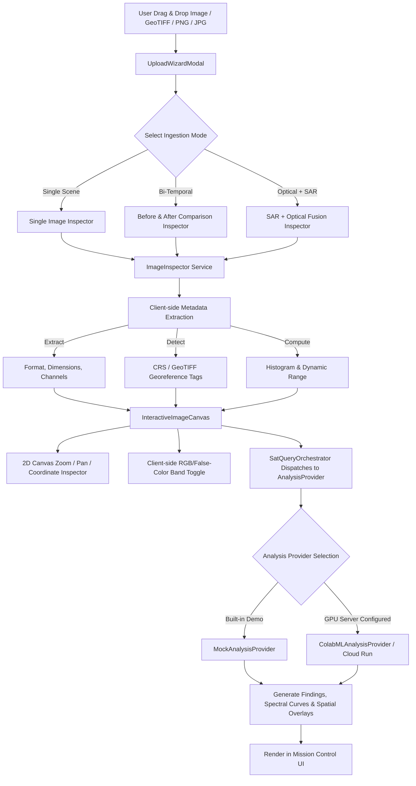
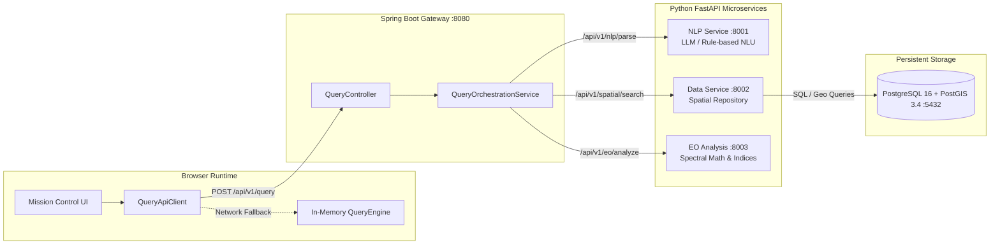
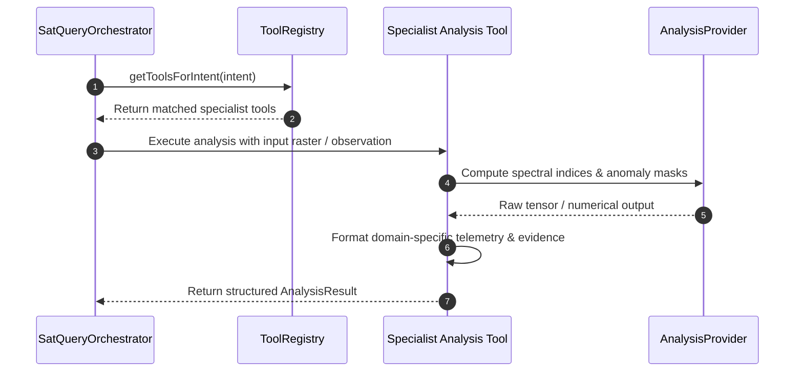

# SatQuery AI — System & Execution Flows

This document details the end-to-end data, execution, and lifecycle flows across the SatQuery AI system architecture.

---

## 1. Primary Request & Analysis Pipeline Flow

The core lifecycle of an Earth Observation query from natural language submission to 3D geospatial rendering and evidence presentation:

---

## 2. Image Ingestion & Multi-Modal Raster Inspection Flow

SatQuery AI supports direct user imagery uploads (single scene, bi-temporal baseline/resurvey, or optical + SAR fusion):

---

## 3. Microservice Orchestration Architecture

---

## 4. Agentic Remote Sensing Tool Invocation Flow

SatQuery AI incorporates a modular `ToolRegistry` with specialized remote-sensing agents:

| Tool Identifier | Category | Target Domain | Implementation Status |
|-----------------|----------|---------------|-----------------------|
| `spectral_index_calculator` | Optical Analysis | NDVI, NDWI, NDBI, NBR, EVI band math | **VERIFIED IN CODE** |
| `canopy_disturbance_detector` | Forest Monitoring | Canopy attenuation & deforestation tracking | **VERIFIED IN CODE** |
| `water_extent_tracker` | Hydrology | Surface water contraction & shoreline delta | **VERIFIED IN CODE** |
| `sar_coherence_analyzer` | Radar Remote Sensing | SAR VV/VH amplitude & surface roughness change | **VERIFIED IN CODE** |
| `fire_scar_mapper` | Disaster Response | NBR pre/post burn severity & perimeter mapping | **VERIFIED IN CODE** |
| `urban_growth_profiler` | Urban Planning | Impervious surface expansion & NDBI change | **VERIFIED IN CODE** |

---

## 5. Startup & Initialization Flow

1. **Docker Compose Startup**:
   - `postgres` initializes schema `001_initial_schema.sql` and seeds `002_seed_regions.sql`.
   - `nlp-service`, `data-service`, and `eo-analysis-service` boot on ports `8001`, `8002`, and `8003`.
   - `spring-boot-backend` starts on port `8080`, probes downstream microservice health endpoints.
   - `frontend` Nginx starts on port `3000`, serving production React assets and proxying `/api/*` to `:8080`.
2. **Client Browser Initialization**:
   - Downloads static bundle, assets, and Cesium / Three.js modules.
   - Loads landing page with interactive Three.js 3D globe and Lenis smooth scrolling.
   - On transition to Mission Control, initializes CesiumJS viewer with ESRI World Imagery and terrain providers.
   - Probes backend health endpoint `/api/v1/health`; enables full microservice mode or in-memory fallback transparently.
